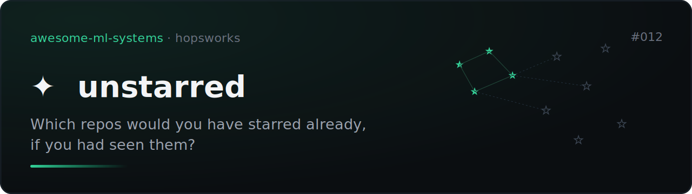
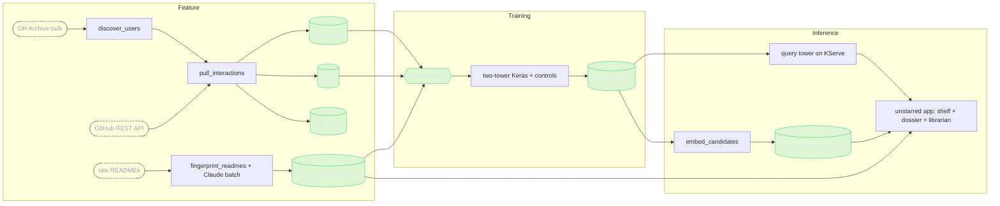

# unstarred



[](https://github.com/MagicLex/awesome-ml-systems)
[](https://www.hopsworks.ai/)

Which repos would you have starred already, if you had seen them? A two-tower
retrieval model trained on public star histories reads your stars and your own
repos, and ranks the corpus you haven't seen. An LLM sits on top in three
load-bearing roles: it fingerprints every candidate README (the cold-start
path), it writes your taste dossier, and it is the librarian you can talk to.
The librarian never picks a repo. It compiles your words into queries against
the trained space and the fingerprint index; every recommendation is a K-NN
hit from the model.

A recommendation is resemblance to starring behavior, never a quality verdict.

**Status: under construction.** The pipelines below are live; held-out numbers
land here with the first registered model.

## Architecture

An FTI (feature, training, inference) system on Hopsworks. Feature extraction
is one shared, pure module (`unstarred_features.py`), imported by the feature
pipeline, the trainer, and the serving predictor, so training and serving
cannot skew.



The file-by-file map:

```
unstarred_features.py   shared, pure: API objects -> rows; user history -> taste scalars
discover_users.py       F1  GH Archive WatchEvents -> active starrer seed list   (job)
pull_interactions.py    F2  API snowball -> star_events, repos, own_repos        (job)
fingerprint_readmes.py  F3  READMEs -> Claude fingerprints -> repo_fingerprints  (job)
train_towers.py         T   unstarred_fv -> two-tower + controls -> registry     (job)
embed_candidates.py     I1  candidate tower over corpus -> repo_embeddings       (job)
predictor.py            I2  KServe: login -> live pull -> user vector + profile
app/server.py           I3  the app: shelf, dossier, ask-the-librarian
deploy_*.py             one per job/deployment/app
```

## Data

All public and free. GH Archive hourly event dumps (bulk, no auth) to discover
currently-active starring users; the GitHub REST API (5000 req/hr with any
free token) for full per-user star histories with `starred_at` timestamps and
each user's own public repos; READMEs via raw.githubusercontent, snapshotted
on one capture date so no text from after the temporal split leaks in.
Captures are kept out of git.

## Honesty rules

- Metric is recall@k / MRR on stars users actually added **after** the
  temporal split; features only ever see the window before it.
- Blind baseline is popularity in the feature window: what a trending list
  gives everyone. If the model cannot beat that, it has learned nothing
  personal.
- Controls: shuffled-label run (must collapse) and a fingerprint-off ablation
  (reported either way).
- The model registry keeps every version, including retired ones, with their
  metrics and the note why.

## Reproduce

Clone into a Hopsworks project on the `/hopsfs/...` FUSE mount. Paths
self-derive. Secrets: `GITHUB_TOKEN`, `ANTHROPIC_API_KEY` in project secrets.

```bash
python deploy_discover.py     && hops job run discover-users        # F1
python deploy_pull.py         && hops job run pull-interactions     # F2 (hours, resumable)
python deploy_fingerprints.py && hops job run fingerprint-readmes   # F3
python deploy_train.py        && hops job run train-towers          # T
python deploy_embed.py        && hops job run embed-candidates      # I1
python deploy_serving.py                                            # I2 KServe
python app/deploy_app.py                                            # I3 the app
```
